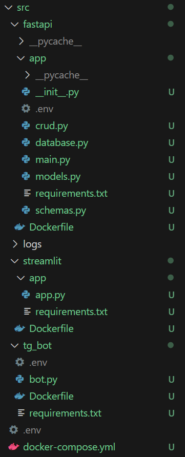

# forecasting_russian_stock_prices
Выпускная квалификационная работа по прогнозированию цен российских акций

# Запуск кода локально
`docker-compose up --build -d`

Будут запущены fastapi, stramlit, postgres и telegram_bot
Для телеграм бота необходимо в .env установить BOT_TOKEN
Для fastapi и docker-compose прописать POSTGRES_DB, POSTGRES_USER, POSTGRES_PASSWORD

# Удаление контейнеров
`docker-compose down` с опцией -v будут удалены volums с бд
